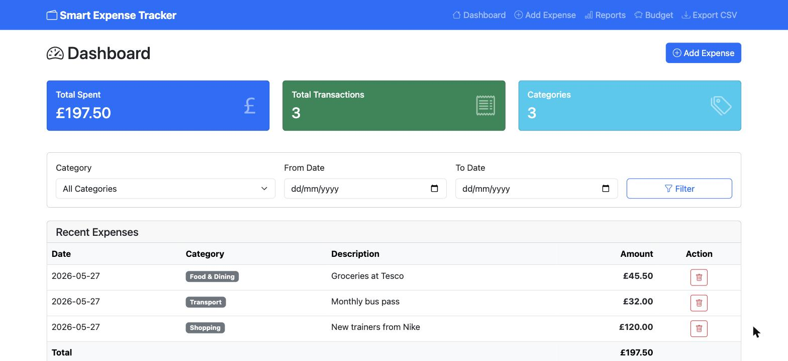
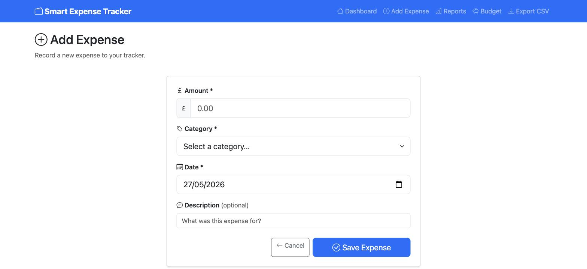
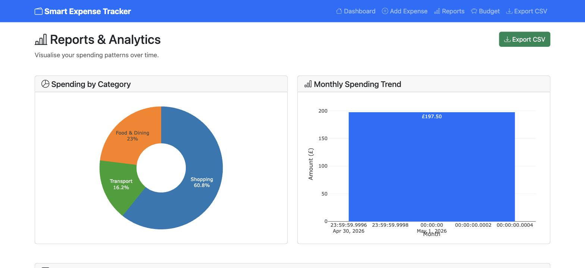
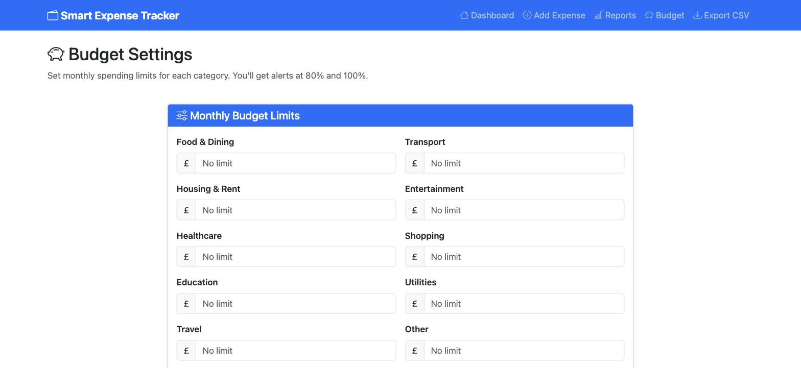

# 💰 Smart Expense Tracker


A full-featured **expense tracking web application** built with Python and Flask. Track your daily expenses, set budgets, visualize spending patterns with interactive charts, and export your data to CSV.

---

## 🚀 Features

- **Add & Manage Expenses** – Log expenses with category, amount, date, and notes
- **Budget Alerts** – Set monthly budgets per category and get alerts when exceeded
- **Interactive Charts** – Pie charts and bar graphs for spending visualization (Plotly)
- **CSV Export** – Download your expense history as a CSV file
- **Filter & Search** – Filter expenses by date range, category, or amount
- **Responsive UI** – Clean, mobile-friendly interface with Bootstrap 5
- **SQLite Database** – Lightweight local database, no external server needed

---

## 📸 Screenshots

### Dashboard


### Add Expense


### Reports & Analytics


### Budget Settings


---

## 🛠️ Tech Stack

| Technology | Purpose |
|------------|---------|
| Python 3.9+ | Backend language |
| Flask 2.3 | Web framework |
| SQLite | Database |
| Plotly | Interactive charts |
| Bootstrap 5 | Frontend UI |
| Pandas | Data processing & CSV export |

---

## ⚙️ Installation

### Prerequisites
- Python 3.9 or higher
- pip (Python package manager)

### Steps

```bash
# 1. Clone the repository
git clone https://github.com/yaksheshrao/smart-expense-tracker.git
cd smart-expense-tracker

# 2. Create a virtual environment
python -m venv venv
source venv/bin/activate      # On Windows: venv\Scripts\activate

# 3. Install dependencies
pip install -r requirements.txt

# 4. Run the application
python app.py
```

Open your browser and navigate to `http://localhost:5000`

---

## 📁 Project Structure

```
smart-expense-tracker/
│
├── app.py                  # Main Flask application
├── models.py               # Database models
├── requirements.txt        # Python dependencies
│
├── templates/
│   ├── base.html           # Base template
│   ├── index.html          # Dashboard
│   ├── add_expense.html    # Add expense form
│   └── reports.html        # Charts & reports
│
├── static/
│   ├── css/
│   │   └── style.css       # Custom styles
│   └── js/
│       └── charts.js       # Chart rendering logic
│
└── utils/
    ├── export.py           # CSV export helper
    └── budget.py           # Budget alert logic
```

---

## 🧪 Usage

### Adding an Expense
1. Click **"Add Expense"** from the dashboard
2. Enter amount, category (Food, Transport, etc.), date, and optional notes
3. Click **Save** — it appears instantly in your dashboard

### Setting a Budget
1. Go to **Settings → Budget**
2. Set a monthly limit for each category
3. You'll see a warning badge when you exceed 80% of the limit

### Exporting Data
1. Go to **Reports**
2. Select a date range
3. Click **Export CSV** to download your filtered expenses

---

## 📊 Expense Categories

- 🍕 Food & Dining
- 🚌 Transport
- 🏠 Housing & Rent
- 🎭 Entertainment
- 🏥 Healthcare
- 🛒 Shopping
- 📚 Education
- 💡 Utilities
- ✈️ Travel
- 🔧 Other

---

## 🤝 Contributing

Contributions are welcome! Please follow these steps:

1. Fork the repository
2. Create a new branch: `git checkout -b feature/your-feature-name`
3. Make your changes and commit: `git commit -m "Add your feature"`
4. Push to your branch: `git push origin feature/your-feature-name`
5. Open a Pull Request

---

## 📄 License

This project is licensed under the MIT License — see the [LICENSE](LICENSE) file for details.

---

## 👤 Author

**Yakshesh Rao**
- GitHub: [@yaksheshrao](https://github.com/yaksheshrao)

---

⭐ If you found this project helpful, please give it a star!
